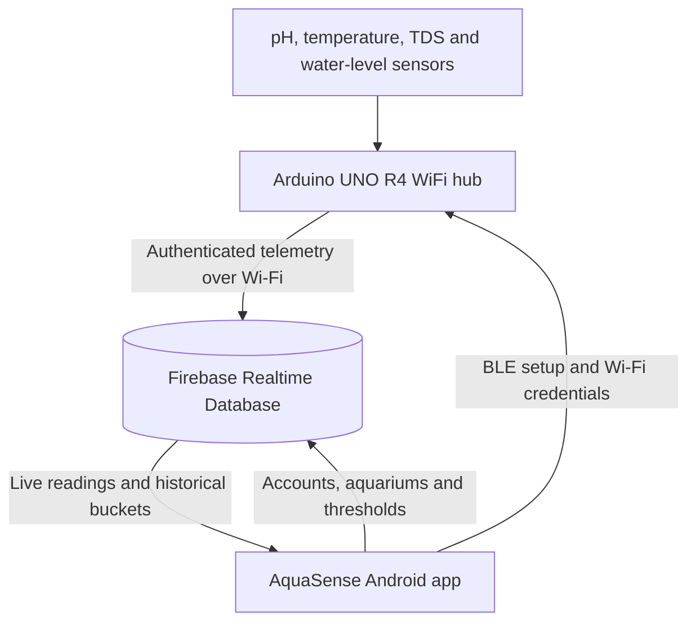

# AquaSense

**An end-to-end aquarium monitoring system that connects physical water-quality sensors to an Android app that displays real-time aquarium status, trends, and actionable alerts, built for safer aquatic environments.**

[](android)
[](firmware)
[](database)
[](#project-status-and-limitations)

AquaSense combines an Arduino-based sensor hub enclosure, cloud telemetry, and an Android application to monitor four essential aquarium parameters: **temperature, pH, total dissolved solids (TDS), and water level**. The system provisions the hub over Bluetooth Low Energy (BLE), publishes readings from an Arduino UNO R4 WiFi over Wi-Fi, visualizes live and historical readings in the Android app, and alerts users when readings cross aquarium-specific thresholds or stop arriving.

A user can manage multiple aquariums, each with its own template, thresholds, spike-detection settings, notification history, and analytics. The final system prototype targets both professional hobbyists and businesses that work with aquatic environments.

> Developed by a five-person engineering team as part of Concordia University's COEN/ELEC 390 product-design course project.

## Technology Stack

| Layer | Technologies |
| --- | --- |
| Android Application | Java, HTML, Android SDK, XML layouts, Material 3, AndroidX Navigation, foreground services |
| Auth and Database | Firebase Authentication, Firebase Realtime Database (NoSQL) |
| Data Visualization | MPAndroidChart |
| Firmware | Arduino/C++, WiFiS3, ArduinoBLE, EEPROM, NTP, HTTP, ArduinoJson |
| Hardware | Arduino UNO R4 WiFi, DS18B20 temp sensor, analog pH and TDS probes, non-contact liquid-level sensor |
| Tools | Gradle, JUnit, Espresso, Arduino CLI, `clang-tidy`, Pytest, GitLab CI, AutoDesk Fusion |

## Features

### App Highlights 

- **Live dashboard** — See the latest readings and an at-a-glance Normal, Warning, Critical, or Disconnected status.
- **Four sensor categories** — Monitor temperature, pH, dissolved solids, and water level.
- **Historical analytics** — Explore sensor trends across several time ranges, review summary statistics, and export readings.
- **Custom safety thresholds** — Define safe, warning, and critical ranges for each aquarium.
- **Background alerts** — Receive threshold and connection-loss notifications even when the app is not open.
- **Multi-aquarium support** — Create, configure, and switch between multiple aquarium profiles.
- **Guided onboarding** — Pair hardware over BLE, provision Wi-Fi, and create an aquarium through a setup wizard.
- **Templates and settings** — Start from built-in aquarium template presets; adjust display units, notification behavior, and appearance.
- **Account security** — Firebase Authentication and owner-scoped Realtime Database rules keep user data separated.
- **Built-in guidance** — Sensor tooltips, calibration help, a troubleshooting guide, and privacy/support pages are available in the app.

### Monitoring & Alerts

- Dynamic **Normal**, **Warning**, **Critical**, or **Disconnected** dashboard aquarium status alongside live readings for temperature, pH, TDS, and water level
- Customizable safe, warning, and critical bands per aquarium
- 4 built-in aquarium templates with verified preset safe, warning, and critical thresholds --> Freshwater: Tropical, Coldwater: Goldfish, Hardwater: African Cichlid, Saltwater: Marine
- Spike detection for sudden parameter changes with configurable spike value
- Continuous background stale-data monitoring
- Instant background notifications whenever parameters drift to warning or critical values
- Notification history labelled with sensor status, name & timestamp with aquarium and sensor filters
- User-friendly sensor tooltips, range explanation, and sensor status-specific response guidance

### Analytics

- Interactive historical charts implemented by MPAndroidChart
- Aquarium, sensor, and time-period filters
- One-hour, one-day, one-week, one-month, six-month, and one-year views per sensor parameter
- Period statistics (minimum, average, maximum), reading distributions, and system-uptime summaries
- Downloadable JSON aquarium history reports
- Controls for clearing historical graph data

### Aquarium Setup and Management

- Email/password registration and Google sign-in with authentication
- Guided first-install aquarium creation and app-hardware pairing wizard
- Advanced threshold and spike-level configuration
- Multiple aquarium profiles under one account
- BLE-based hub discovery and Wi-Fi provisioning
- Guided user-friendly sensor calibration and mounting instructions

### Settings and Support

- Display Configurations: Standard vs. Precise display units, Light vs. Dark vs. Auto themes, Celcius vs. Farenheit temperature units
- Dashboard sensor card rearranging and disabling option for unnecessary sensor parameters
- Notification silencing and per-aquarium notification preferences
- user-configurable Quiet Hours and Maintenance Mode features
- User-friendly password reset and account management
- In-app troubleshooting guide, privacy policy, contact form and support information

## How It Works



AquaSense follows a **publisher-subscriber** architecture:

1. The Android app creates an aquarium profile and connects to the hub over BLE.
2. The app sends the Wi-Fi credentials and owner identifier to the hub.
3. The hub stores the pairing information in EEPROM, connects to Wi-Fi, and synchronizes its clock through NTP.
4. Sensor values are validated, aggregated into historical periods, and published to Firebase Realtime Database.
5. The Android app subscribes to the database, evaluates the aquarium data against user-defined thresholds, updates the dashboard and status, and produces analytics & alerts.

The firmware is designed to recover from network interruptions. Pending periodic updates are cached and committed in batches when communication is restored, while authentication tokens and timestamps are refreshed as needed. The database contains both the latest readings and time-bucketed reading history per sensor parameter.


## Hardware

The hardware prototype is a 3D-printed hub enclosure that uses an **Arduino UNO R4 WiFi**, whose 5 V supply and onboard connectivity support the selected sensors. The 3D-printed hub enclosure was designed in AutoDesk Fusion with an aquarium-rim mounting channel, an elevated enclosed electronics platform, and cable-routing openings to organize and protect the electronic components from water exposure.

| Component | Role |
| --- | --- |
| XKC-Y26-V Non-contact Liquid-level Sensor | Reports whether the aquarium water has dropped below the monitored level |
| DS18B20 Waterproof Temperature Sensor | Measures water temperature over the 1-Wire protocol |
| Analog TDS Sensor Module | Estimates dissolved solids from the water's electrical conductivity |
| Analog pH Probe Kit | Measures the acidity or alkalinity of the water |
| Arduino UNO R4 WiFi | Controls the sensors, provisions connectivity, aggregates readings, and publishes telemetry in cloud |


## Data Model and Access Control

Firebase Realtime Database acts as the central communication layer between the hub and mobile app. Each authenticated user's node contains:

- Account profile information
- One or more aquarium definitions
- Per-sensor thresholds and spike deltas
- Latest instantaneous readings
- Time-bucketed history for supported analytics periods

Firebase rules validate identifiers, required fields, threshold ordering, timestamps, and sensor names. Access is scoped to the authenticated owner, while the paired hub receives only the permissions required to publish telemetry for its aquarium.


## Repository structure

```text
aquasense-app/
├── android/       # Android application, resources, and tests
├── firmware/      # Sensor acquisition, BLE provisioning, and cloud telemetry
├── database/      # Firebase schema and access-control rules
├── scripts/       # Database validation, simulation, and test utilities
└── docs/          # Mission Statement, Design Document, User Manual, etc.
```

## Build & Run

This repository is a completed academic prototype and source-code snapshot. The Firebase project used during development has been permanently deleted, so running the system requires a new Firebase project and new credentials.

### Android Application

Prerequisites:

- Android Studio with Android SDK 36
- JDK 17
- An Android 14 (API 34) or newer device or emulator
- A Firebase project with Email/Password Authentication, Google Authentication, and Realtime Database enabled

1. Clone the repository:

   ```bash
   git clone https://github.com/DipiAreum04/aquasense-app.git
   cd aquasense-app
   ```

2. Register the Android application ID `ca.team6.aquasense` in your Firebase project.

3. Download your Firebase `google-services.json` and place it at:

   ```text
   android/app/google-services.json
   ```

4. Review `database/rules.json` and `database/schema.json`, then adapt and deploy them to your own Realtime Database.

5. Build the debug APK:

   ```bash
   cd android
   ./gradlew assembleDebug
   ```

   On Windows PowerShell, run `cd android` followed by `./gradlew.bat assembleDebug`.


### Firmware

Prerequisites:

- Arduino UNO R4 WiFi
- Arduino IDE (recommended version: 2.3.10 or newer)
- Arduino Libraries: OneWire, DallasTemperature, ArduinoBLE, ArduinoHttpClient, and ArduinoJson

```bash
arduino-cli compile --fqbn arduino:renesas_uno:unor4wifi firmware/src
```

Configure a dedicated Firebase device account for your replacement backend before compiling. Live database URLs, device credentials, and identifiers should be stored outside version control to ensure data privacy & security.

## Validation

The project pipeline builds and lint checks the Android and firmware targets and validates the database rules. Useful local checks include:

```bash
cd android
./gradlew test lintDebug
```

```bash
cd scripts
uv sync
uv run pytest -vv
```

## My contributions

**Dipita Sinha ([@DipiAreum04](https://github.com/DipiAreum04))** contributed across the Android and Cloud layers. Work represented in the imported project history includes:

- Firebase setup, authentication flows, and account-management behavior
- Live dashboard and historical analytics UI improvements
- BLE pairing logic, GATT operation designing, and the first-install setup wizard
- Aquarium creation, templates, advanced settings, and customizable thresholds
- Settings redesign, troubleshooting content, and dark-mode polish
- Integration and merge work across multiple feature branches

## Team

| Team Member                                               | Program Concentration  | Student ID |
| :-------------------------------------------------------: | :--------------------: | :--------: |
| Bilal Samee (https://github.com/b-samee)                  | Computer Engineering   | 27286295   |
| Dominique Reynolds-Sandy (https://github.com/DomDomSandy) | Electrical Engineering | 40241168   |
| Navraj Jhajj (https://github.com/navrajjhajj)             | Computer Engineering   | 40129282   |
| Armaan Khan (https://github.com/Armaank04)                | Electrical Engineering | 40235610   |
| Dipita Sinha (https://github.com/DipiAreum04)             | Computer Engineering   | 40273009   |


## Project Status and Limitations

AquaSense is a Completed Academic Prototype demonstrating the full path from physical sensor acquisition to cloud storage, Android visualization, historical analysis, and background alerts. It is not yet a certified safety system and should not be treated as a substitute for manual aquarium testing or responsible aquarium care advice.

## Security

The Firebase project used by the team has been permanently deleted. Any project-specific configuration or credentials remaining in the imported history refer to that decommissioned environment and can no longer access an active backend.

Anyone adapting the project should create a separate Firebase environment, use least-privilege device accounts, review the database rules, and keep all new credentials out of version control.

## License and Reuse

This collaborative academic project is published with permission from all five team members for portfolio purposes. The current [`LICENSE`](LICENSE) reserves all rights; copying, modification, redistribution, or other reuse requires written permission from every team member.
